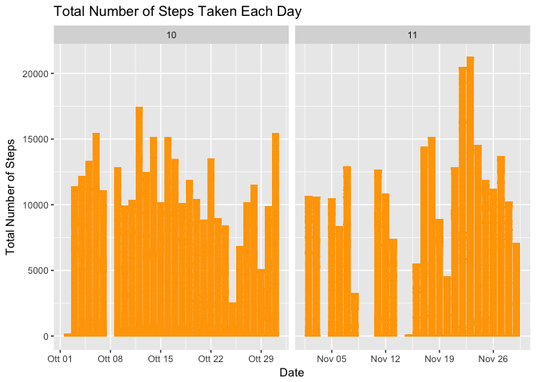
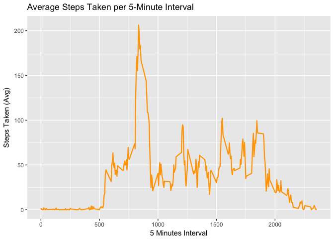
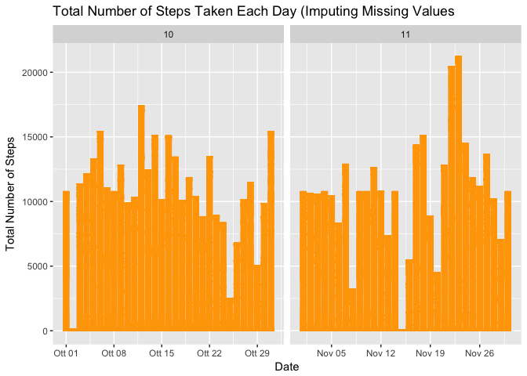

Reproducible Research: Week 2 Assignment
========================================


## Loading and preprocessing the data.


```r
library(ggplot2)
library(dplyr)
activity <- read.csv("activity.csv", colClasses = c("integer", "Date", "factor"))
summary(activity)
str(activity)
head(activity)
tail(activity)
activity$month <- as.numeric(format(activity$date, "%m"))
```


## What is mean total number of steps taken per day?


* We need to exclude missing for this part of the assignment.


```r
activity.full <- na.omit(activity)
rownames(activity.full) <- 1:nrow(activity.full)
head(activity.full)
```

```
##   steps       date interval month
## 1     0 2012-10-02        0    10
## 2     0 2012-10-02        5    10
## 3     0 2012-10-02       10    10
## 4     0 2012-10-02       15    10
## 5     0 2012-10-02       20    10
## 6     0 2012-10-02       25    10
```

```r
tail(activity.full)
```

```
##       steps       date interval month
## 15259     0 2012-11-29     2330    11
## 15260     0 2012-11-29     2335    11
## 15261     0 2012-11-29     2340    11
## 15262     0 2012-11-29     2345    11
## 15263     0 2012-11-29     2350    11
## 15264     0 2012-11-29     2355    11
```


* Make a histogram of the total number of steps taken each day.


```r
ggplot(activity.full, aes(date, steps)) + geom_bar(stat = "identity", width = 0.8, colour = "orange", fill = "orange" ) + labs(title = "Total Number of Steps Taken Each Day", x = "Date", y = "Total Number of Steps") + facet_grid(.~month, scales = "free_x")
```




* Calculate and report the mean and median total number of steps taken per day.


```r
steps.total <- aggregate(activity.full$steps, list(Date = activity.full$date), FUN = "sum")$x
mean <- mean(steps.total)
median <- median(steps.total)
mean
```

```
## [1] 10766.19
```

```r
median
```

```
## [1] 10765
```


## What is the average daily pattern activity?


```r
avg.stepsactivity <- aggregate(activity.full$steps, list(interval = as.numeric(as.character(activity.full$interval))), FUN = "mean")
names(avg.stepsactivity)[2] <- "mean.steps"


ggplot(avg.stepsactivity, aes(interval, mean.steps)) + geom_line(size = 0.8, colour = "orange") + labs(title = "Average Steps Taken per 5-Minute Interval", x="5 Minutes Interval", y="Steps Taken (Avg)")
```



```r
avg.stepsactivity[avg.stepsactivity$mean.steps == max(avg.stepsactivity$mean.steps), ]
```

```
##     interval mean.steps
## 104      835   206.1698
```


## Imputing Missing Values


* Create a new dataset that is equal to the original dataset but with the missing data filled in.


```r
sum(is.na(activity))
```

```
## [1] 2304
```

```r
activity.new <- activity
for (i in 1:nrow(activity.new)) {
    if (is.na(activity.new$steps[i])) {
        activity.new$steps[i] <- avg.stepsactivity[which(activity.new$interval[i] == avg.stepsactivity$interval), ]$mean.steps
    }
}
```


* Make a histogram of the total number of steps taken each day


```r
ggplot(activity.new, aes(date, steps)) + geom_bar(stat = "identity", width = 0.8, colour = "orange", fill = "orange" ) + labs(title = "Total Number of Steps Taken Each Day (Imputing Missing Values", x = "Date", y = "Total Number of Steps") + facet_grid(.~month, scales = "free_x")
```




* Do these values differ from the estimates from the first part of the assignment? What is the impact of imputing missing data on the estimates of the total daily number of steps?


```r
stepstotal.new <- aggregate(activity.new$steps, list(date=activity.new$date), FUN = "sum")$x

mean.new <- mean(stepstotal.new)
median.new <- median(stepstotal.new)
mean.new
```

```
## [1] 10766.19
```

```r
median.new
```

```
## [1] 10766.19
```

```r
mean.difference <- mean - mean.new
median.difference <- median - median.new
mean.difference
```

```
## [1] 0
```

```r
median.difference
```

```
## [1] -1.188679
```


## Are there differences in activity patterns between weekdays and weekends?


* Create a new factor variable in the dataset with two levels – “weekday” and “weekend” indicating whether a given date is a weekday or weekend day.


```r
activity.new$weekdays <- factor(format(activity.new$date, "%A"))
levels(activity.new$weekdays)
```

```
## [1] "Domenica"  "Giovedì"   "Lunedì"    "Martedì"   "Mercoledì" "Sabato"   
## [7] "Venerdì"
```

```r
levels(activity.new$weekdays) <- list(weekday = c("Lunedì", "Martedì",         "Mercoledì", "Giovedì", "Venerdì"), weekend = c("Sabato", "Domenica"))
```


* Make a panel plot containing a time series plot (i.e. 𝚝𝚢𝚙𝚎 = "𝚕") of the 5-minute interval (x-axis) and the average number of steps taken, averaged across all weekday days or weekend days (y-axis). 


```r
avgstepsactivity.new <- aggregate(activity.new$steps, list(interval = as.numeric(as.character(activity.new$interval)), weekdays = activity.new$weekdays), FUN = "mean")
names(avgstepsactivity.new)[3] <- "meansteps.new"
library(lattice)
xyplot(avgstepsactivity.new$meansteps.new ~ avgstepsactivity.new$interval | avgstepsactivity.new$weekdays, 
       layout = c(1, 2), type = "l", 
       xlab = "Interval", ylab = "Number of Steps")
```


